# MSCS 634 – Lab 1: Data Visualization, Preprocessing, and Statistical Analysis

**Name:** Suresh Ghimire  
**Course:** Advanced Big Data and Data Mining (MSCS-634-M20)

**Lab Assignment:** Lab 1  
**Tools Used:** Python, Pandas, Matplotlib, Seaborn

## Overview
This lab applies core data analysis techniques using Python to explore, preprocess, and statistically analyze a real-world dataset. The objective is to gain hands-on experience with data visualization, data cleaning, and statistical interpretation while preparing structured data for deeper analytical tasks.

The dataset used in this lab was extracted from Kaggle (`terencekatua/retail-sales-dataset`). All analysis was performed using Python in a Jupyter Notebook environment.

---

## Purpose of the Lab
The purpose of this lab is to:
- Load and explore a real-world dataset using Pandas.
- Create meaningful visualizations to identify trends, patterns, and distributions.
- Perform data preprocessing including handling missing values, outlier detection, data reduction, scaling, and discretization.
- Conduct statistical analysis using central tendency, dispersion measures, and correlation analysis.
- Develop practical data preparation skills for data mining and machine learning workflows.

---

## Dataset Description
- **Source:** Kaggle
- **Dataset Name:** Retail Sales Dataset
- **Author:** terencekatua
- **Link:** https://www.kaggle.com/datasets/terencekatua/retail-sales-dataset

The dataset contains retail transaction data including customer demographics, product categories, quantities purchased, pricing information, and total purchase amounts.

---

## Tools and Technologies Used
- Jupyter Notebook
- Python
- Pandas
- Matplotlib
- Seaborn
- Scikit-learn

---

## Step 1: Data Collection
The dataset was loaded into a Pandas DataFrame and initially explored using `.head()` to verify structure and content.

**Screenshot :**
- 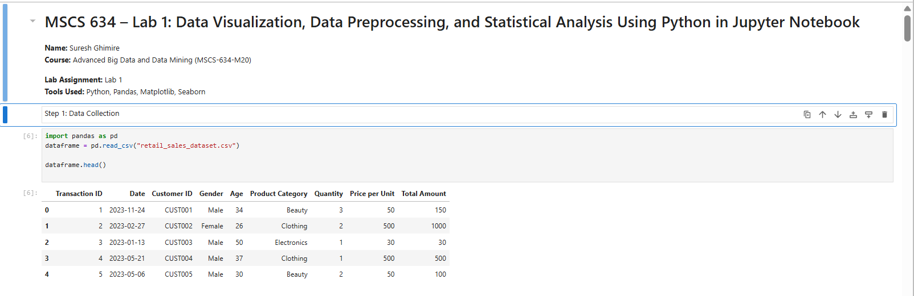
---

## Step 2: Data Visualization
The following visualizations were created:
- Scatter Plot: Age vs Total Amount
- Line Plot: Total Sales Over Time
- Bar Chart: Total Sales by Product Category
- Histogram: Distribution of Customer Age
- Pie Chart: Proportion of Sales by Product Category

**Screenshot :**
- 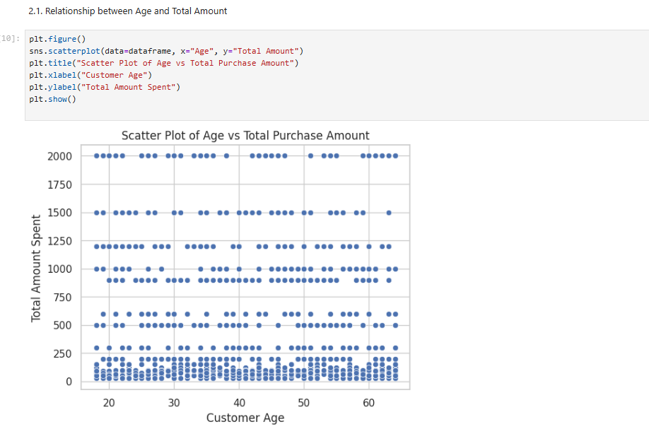
- 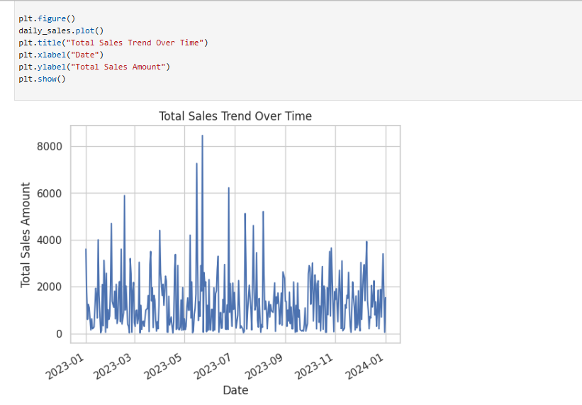
- 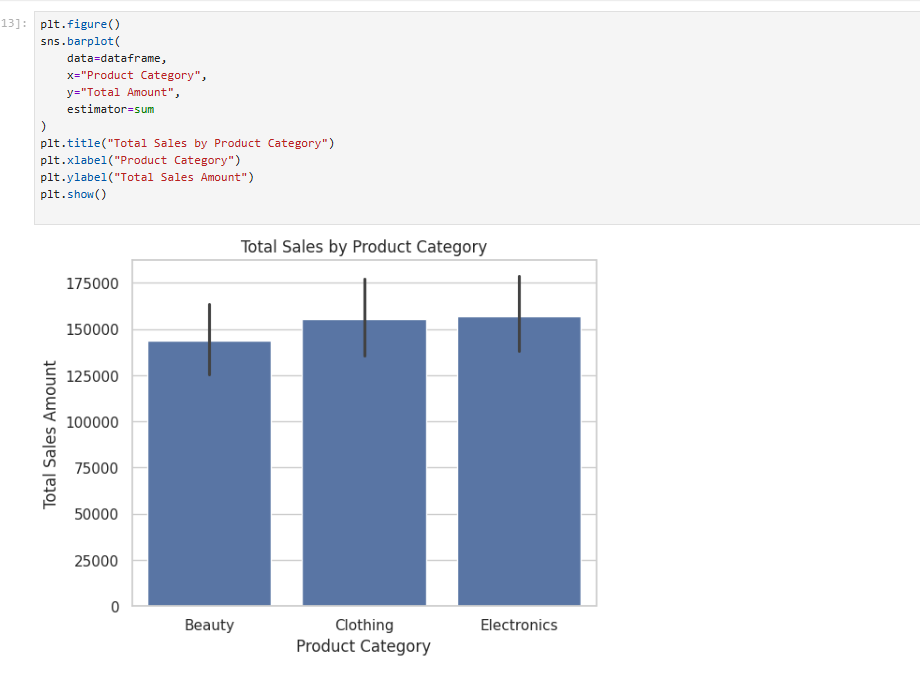
- 
- 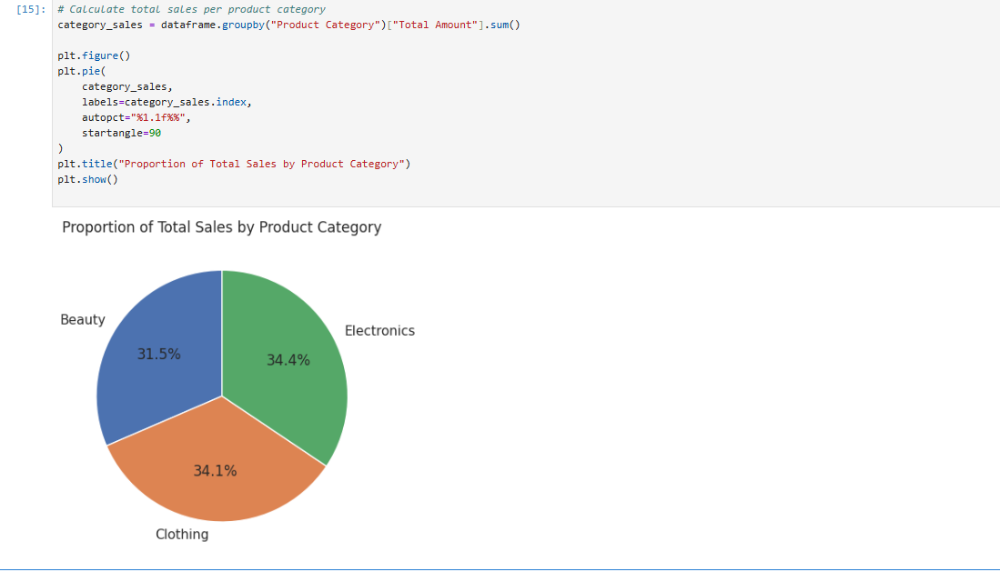
---

## Step 3: Data Preprocessing

### Missing Value Handling
Numerical columns were filled using mean values and categorical columns using mode values.

**Screenshot :**
- 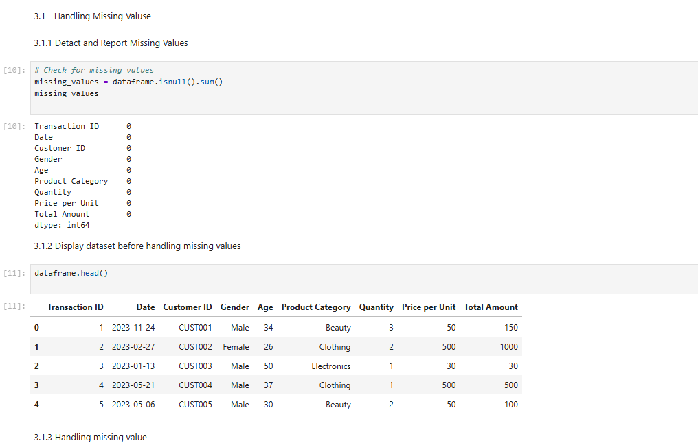
- 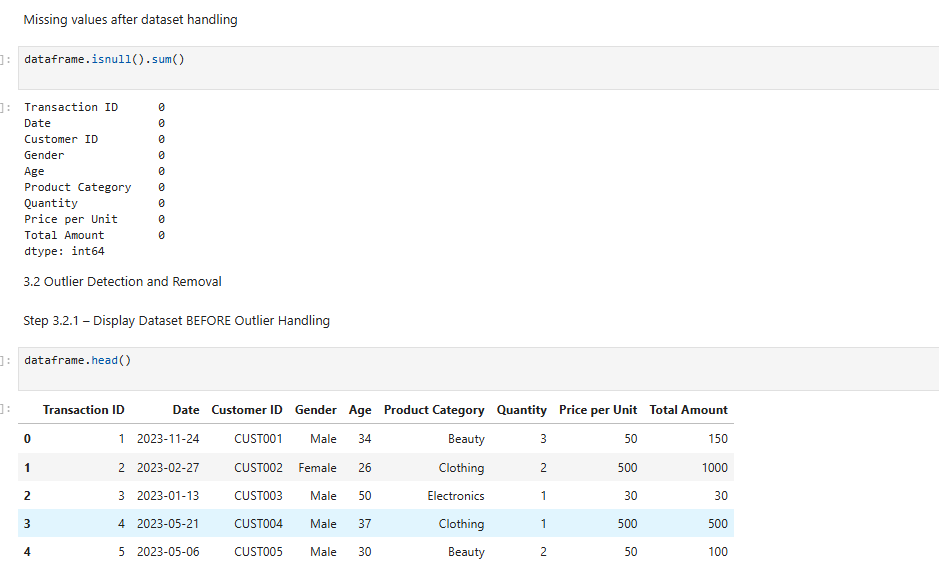

### Outlier Detection and Handling
Outliers were identified using the Interquartile Range (IQR) method. No significant outliers were detected.

**Screenshot :**
- 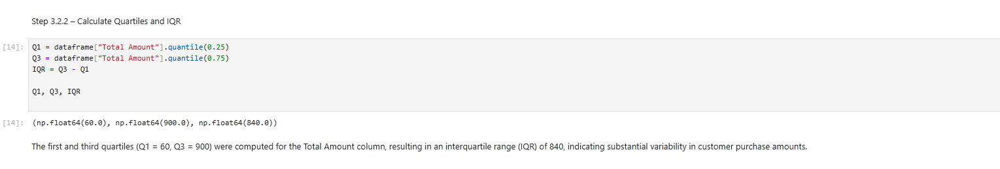
- 
- 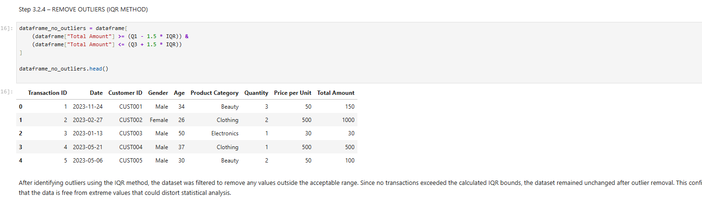

### Data Reduction
Random sampling was applied and identifier columns were removed.

**Screenshot :**
- 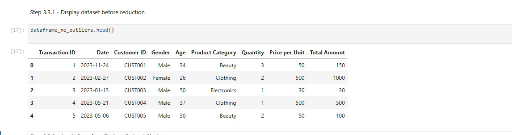
- 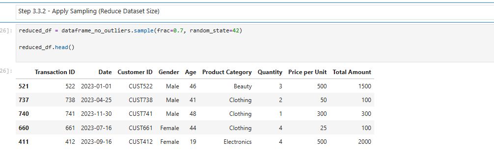
- 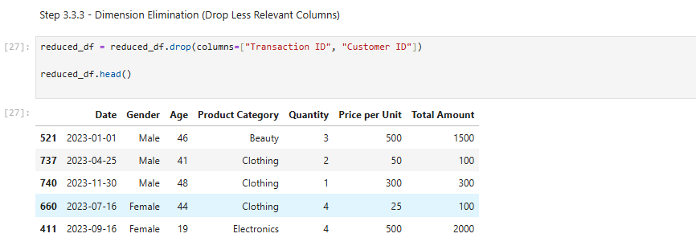

### Data Scaling and Discretization
Min-Max scaling was applied and age values were discretized into categories.

**Screenshot :**
- 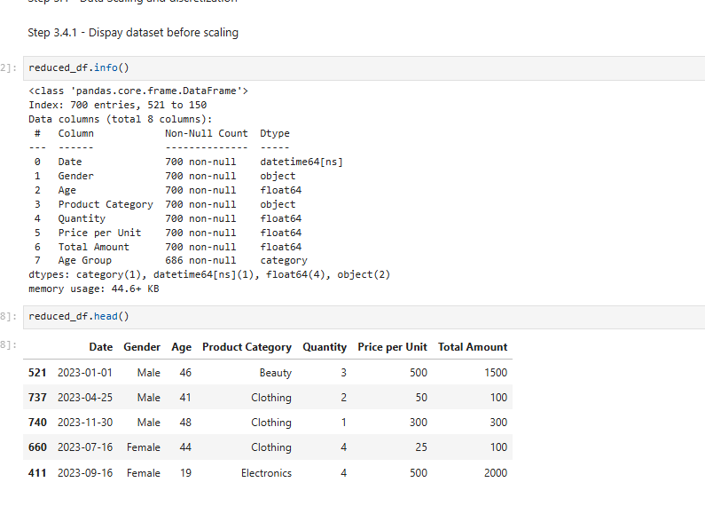
- `
- 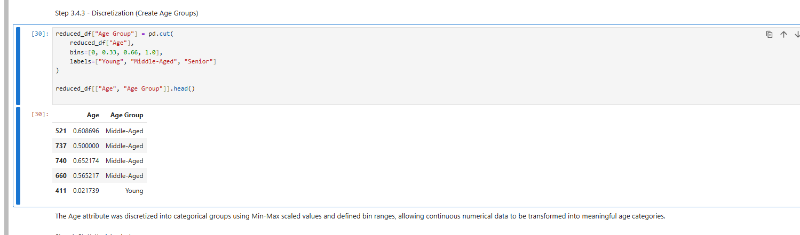

---

## Step 4: Statistical Analysis

### General Overview
Dataset structure and summary statistics were reviewed.

**Screenshot :**
- 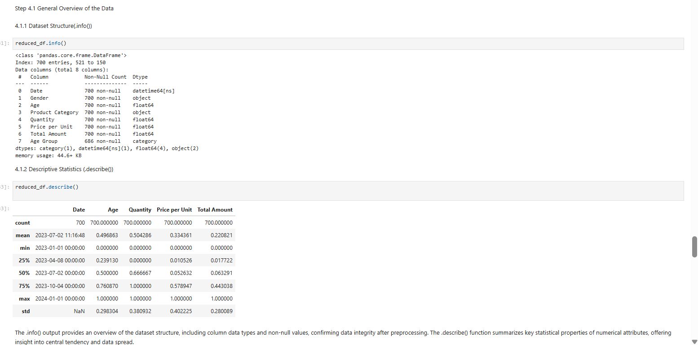

### Central Tendency Measures
Minimum, maximum, mean, median, and mode were calculated.

**Screenshot :**
- 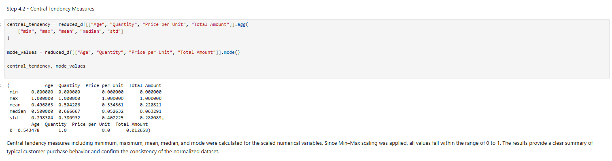

### Dispersion Measures
Variance, standard deviation, quartiles, and IQR were computed.

**Screenshot :**
- 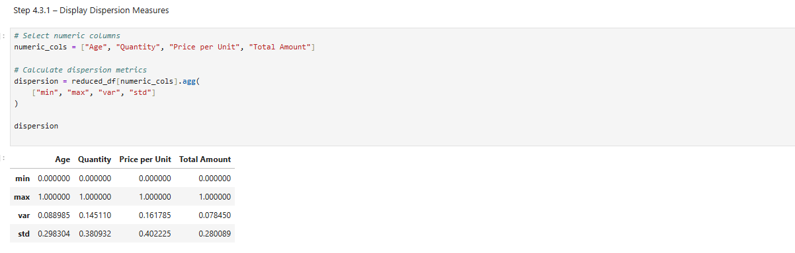
- 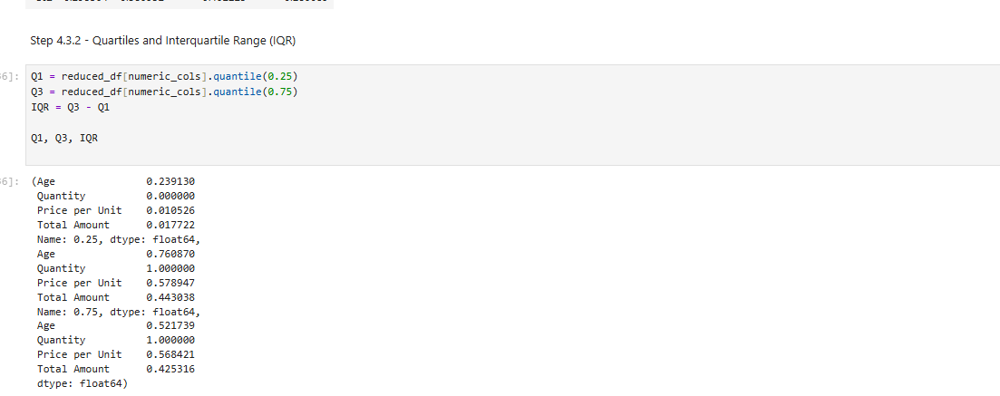

### Correlation Analysis
A correlation matrix was generated for numerical variables.

**Screenshot :**
- 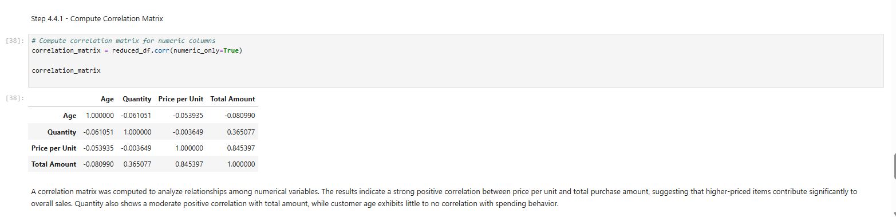

---

## Key Insights from the Analysis
- Product price has a strong influence on total purchase amount.
- Quantity purchased has a moderate impact on total sales.
- Customer age shows minimal correlation with spending behavior.
- Preprocessing resulted in a clean, well-structured dataset.

---

## Challenges and Decisions
- Pandas chained assignment warnings were resolved using assignment-safe methods.
- Min-Max scaling was chosen for normalization.
- Discretization was applied to support categorical analysis.

---

## Files Included in the Repository
- `MSCS_634_Lab_1.ipynb`
- `retail_sales_dataset.csv`
- `screenshots/`
- `README.md`

---

## Conclusion
This lab demonstrates a complete data analysis workflow, from data collection and visualization to preprocessing and statistical evaluation, highlighting how structured analysis supports data-driven decision-making.
